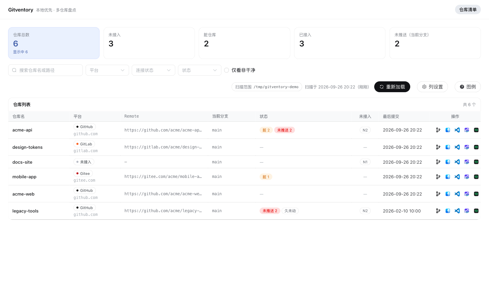
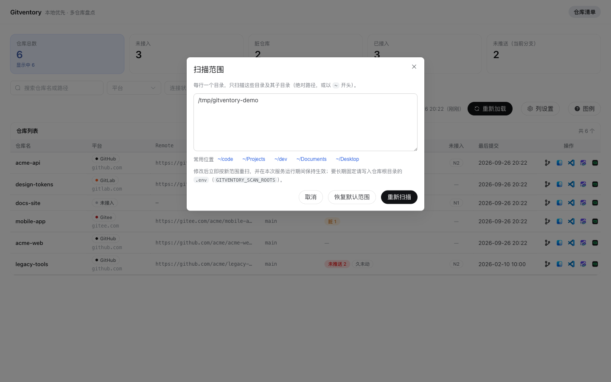

# Gitventory

[](https://github.com/WanaTea/gitventory/actions/workflows/ci.yml)

把本机上散落各处的 git 仓库扫出来，一眼看清它们各自属于哪个平台、有没有接远程、有没有未提交 / 未推送。

> `Gitventory` = **git** + **inventory**（盘点）· Local-first dashboard for the git repositories already on your machine.

- 只监听 `127.0.0.1`：不联网、无遥测、不上传任何数据
- 直接调用你本机的 `git`，复用你已有的凭据
- 覆盖 GitHub / GitLab / Gitee / Codeup / CODING，自建 GitLab 可通过配置识别
- 仓库清单 + 分支管理（切换 / 拉取 / 推送 / 删除分支 / 撤销文件改动）都在本地面板里完成

## 界面预览

> 图里全部是**演示数据**（6 个假仓库，覆盖 GitHub / GitLab / Gitee / 未接入四种平台，以及脏、未推送、久未动各状态），
> 不来自任何人的真实仓库。

**仓库清单**：顶部概览点击即筛选；工具区右侧是当前扫描范围（点它就能改）与重新加载；每行给出平台、Remote、状态标签。



**Git 分支管理**（双击任意行，或点操作列的 Git 图标）：分支切换 / 推送 / 删除、提交记录、当前分支的改动与撤销集中在一个弹窗里。


**扫描范围**：第一次打开若没扫到仓库，点工具区的「扫描范围」就地修改并立即重扫。



## 快速开始

需要 **Node ≥ 22.18** 与 **git**。

```bash
git clone https://github.com/WanaTea/gitventory.git
cd gitventory
npm run launch
```

`npm run launch` 会把剩下的事一次做完：检查 Node / git 版本 → 装依赖 → 构建前端 → 起服务 → 打开浏览器。
做过的步骤会跳过，以后再用同一条命令即可（默认地址 http://127.0.0.1:8787）。

端口被占用时它会直接告诉你，换一个即可：`PORT=8899 npm run launch`。

要改代码的话用开发模式，前后端分离 + 热更新：

```bash
npm run dev   # 前端 http://localhost:5173 ，/api 代理到 8787
```

> **为什么 Node 要求 ≥ 22.18**：服务端直接用 `node src/index.ts` 跑 TypeScript，
> 依赖 Node 的原生类型剥离（22.18 起默认启用）。版本过低会抛
> `ERR_UNKNOWN_FILE_EXTENSION: Unknown file extension ".ts"` —— 这个报错看不出原因，
> 所以在这里先说清楚。
>
> **版本固定**：`.nvmrc` 钉了 `22.22.3`（本机验证过的版本），`nvm use` 即可切换；
> `package.json` 的 `engines` 写的是最低门槛 `>=22.18`，CI 用 `.nvmrc` 的版本跑。

## 第一次打开没扫到仓库？

扫描范围默认取「**存在**的常见目录」：`~/code`、`~/Projects`、`~/dev`、`~/Documents`、`~/Desktop` 等，
全都不存在时退回 home 目录本身。

仓库不在这些位置时，页面工具区右上角的 **扫描范围** 可以直接改：填绝对路径（支持 `~`）后重扫，
修改在本次服务运行期间持续生效。

想长期固定，写进仓库根目录的 `.env`：

```bash
cp .env.example .env
# 然后编辑 GITVENTORY_SCAN_ROOTS=~/code,~/work/repos
```

识别规则：只把含 `.git` 的目录算作仓库，向下最多 5 层，隐藏目录与 `node_modules` 会被跳过。

## 常用命令

| 命令 | 作用 |
| --- | --- |
| `npm run launch` | **一键启动**：检查环境 → 装依赖 → 构建 → 起服务 → 开浏览器 |
| `npm run dev` | 同时启动服务端（8787）与前端（5173，带热更新与 `/api` 代理） |
| `npm run build` | 构建前端到 `web/dist` |
| `npm start` | 只启动服务端；`web/dist` 存在时由同一端口托管前端 |
| `npm run lint` | 服务端 + 前端 lint |
| `npm run typecheck` | 服务端 + 前端类型检查 |
| `npm run smoke` | 起一次真实服务做冒烟自检（建临时仓库 → 扫目录 → 采集 git → 校验接口） |

生产形态：`npm run build && npm start`，然后打开 http://127.0.0.1:8787 。

## 配置

环境变量与根目录 `.env` 等效（模板见 `.env.example`）：

| 变量 | 默认 | 说明 |
| --- | --- | --- |
| `GITVENTORY_SCAN_ROOTS` | 自动探测 | 扫描根，逗号分隔，支持 `~` |
| `GITVENTORY_SELF_HOSTED_HOSTS` | 空 | 自建 Git 实例的 host 前缀，逗号分隔；命中即归类为 GitLab |
| `PORT` | `8787` | 服务端口；改了它需同步 `web/vite.config.ts` 里的代理目标 |
| `GITVENTORY_STALE_DAYS` | `90` | 「久未动」阈值天数 |
| `GITVENTORY_DATA_DIR` | `~/.gitventory` | 数据目录 |

## 用外部应用打开（可配置）

仓库行与分支弹窗里的「用 XX 打开」按钮不是写死的应用列表：**内置一套常见应用、按当前系统解析命令**，
你也可以用一份配置文件接管（比如换成 JetBrains、Sublime、Windows Terminal）。

```bash
cp config/open-targets.example.json config/open-targets.json
```

| 字段 | 必填 | 说明 |
| --- | --- | --- |
| `id` | ✅ | 唯一标识；前端按它取图标，未知 id 用通用图标，不会因为缺图标而消失 |
| `label` | | 展示名，缺省取 `id` |
| `labels` | | 平台专属展示名，例 `{ "win32": "在资源管理器中打开" }` |
| `commands` | ✅ | 各平台命令数组，**末位由程序追加仓库绝对路径**；缺某平台 = 该平台不支持该目标 |
| `apps` | | 仅用于「装没装」的探测路径（绝对路径，支持 `~`）；给了就按它判可用性 |
| `always` | | 系统自带命令（`explorer` / `xdg-open`）：恒可用，不去 PATH 里找 |
| `ignoreExitCode` | | 成功也返回非 0 的命令（Windows 的 `explorer` 会返回 1） |

命令里写 `%APP%` 会替换为 `apps` 里探测到的应用绝对路径（macOS 的 `open -a` 需要）。

**合并规则**：默认按 `id` 覆盖/追加内置项（只想改一个应用，不必抄整份配置）；写
`"replaceDefaults": true` 则完全采用文件里的列表，也就能删掉用不上的内置项。
配置文件改动最多 30 秒生效（读取带缓存）；写坏了会退回内置默认值并把原因打进启动日志，不会让服务起不来。

内置默认：

| 目标 | macOS | Windows | Linux |
| --- | --- | --- | --- |
| 文件管理器 | `open` | `explorer` | `xdg-open` |
| VS Code | `open -b com.microsoft.VSCode` | `code` | `code` |
| CodeBuddy CN | `open -b com.tencent.codebuddycn` | 未配置 | 未配置 |
| Trae | `open -a Trae` | 未配置 | 未配置 |
| Warp | `open -b dev.warp.Warp-Stable` | 未配置 | 未配置 |

> CodeBuddy / Trae / Warp 的 Windows 命令名**没有实测过，所以故意留空**：按钮会显示「当前系统（win32）未配置该打开方式」，
> 而不是写一个猜的命令名，让人点了之后莫名失败。填法参考模板里的 `idea` 条目（JetBrains 用 `idea64.exe`）。

### 让 AI 帮你配置「用外部应用打开」

自己找应用路径很烦，而且 macOS 与 Windows 的装法完全不同。**把下面这段发给你的 AI**
（CodeBuddy / Cursor / Claude Code / Trae 都可以），它会扫一遍你本机装了哪些编辑器与终端，
直接写好 `config/open-targets.json` 并验证一遍。

候选路径清单在 [docs/open-targets-paths.md](./docs/open-targets-paths.md)（macOS / Windows 各一份，
每条标了置信度，另有「待实测」一节 —— 别照抄没验证过的路径）。

````text
请帮我为 Gitventory 配置「用外部应用打开」（仓库地址见当前项目）。

1. 先判断我用的系统（macOS 还是 Windows）。
2. 读 docs/open-targets-paths.md，按里面的候选路径逐个检查我本机是否**真实存在**
   （用文件存在性判断，不要凭猜测）；不存在的直接丢弃，不要写进配置。
3. 复制 config/open-targets.example.json 为 config/open-targets.json，只为真实存在的应用写条目：
   commands 优先写 PATH 上的命令名，PATH 上没有就写绝对路径（本项目支持绝对路径直判可用）。
4. Windows 路径在 JSON 里的反斜杠要转义成 \\。
5. 起服务验证：npm start，然后看 http://127.0.0.1:8787/api/health 里 openTargets 各项的
   available 与 reason —— available: false 的就是还缺配置或没装，reason 会说清原因。
6. 不确定的路径不要编造，单独列一节「待实测」告诉我。
7. 最后给我一份「保留了什么 / 丢了什么 / 待实测什么」的清单。
````

不想用 AI 也行，照这张表自己填（完整版含 iTerm2 / Warp / kitty / Tabby / JetBrains 全家桶在
[docs/open-targets-paths.md](./docs/open-targets-paths.md)）：

| 应用 | macOS | Windows |
| --- | --- | --- |
| VS Code | `/Applications/Visual Studio Code.app` | `%LOCALAPPDATA%\Programs\Microsoft VS Code\Code.exe` |
| Cursor | `/Applications/Cursor.app` | `%LOCALAPPDATA%\Programs\cursor\Cursor.exe` |
| IntelliJ IDEA | `/Applications/IntelliJ IDEA.app` | `%ProgramFiles%\JetBrains\IntelliJ IDEA\bin\idea64.exe` |
| Sublime Text | `/Applications/Sublime Text.app` | `%ProgramFiles%\Sublime Text\sublime_text.exe` |
| Android Studio | `/Applications/Android Studio.app` | `%LOCALAPPDATA%\Programs\Android Studio\bin\studio64.exe` |
| 终端 | `/Applications/iTerm.app`、`/Applications/Warp.app` | `wt`（Store 版在 `%LOCALAPPDATA%\Microsoft\WindowsApps\wt.exe`） |
| 终端（Windows 专属） | — | PowerShell 7：`%ProgramFiles%\PowerShell\7\pwsh.exe`、Git Bash：`%ProgramFiles%\Git\git-bash.exe` |

两点提醒：

- 配置文件里**只能写绝对路径或以 `~` 开头**（`expandHome()` 不解析 `%LOCALAPPDATA%` 这类环境变量），
  所以把上表的 `%VAR%` 换成展开后的真实路径。Windows 还要把 `\` 写成 `\\`。
- 同一个应用常有两个安装位置（用户级 `%LOCALAPPDATA%\Programs\...` 与系统级 `%ProgramFiles%\...`），
  两个都试一下——装的时候没要管理员权限的会落在前者。

## 平台差异

- **「用外部应用打开」跨平台，默认命令按系统不同**：macOS 走 `open` + bundle id，Windows / Linux 走 PATH 上的命令。
  某目标在某平台没配命令、或应用没装、或命令不在 PATH 时，按钮会被禁用并给出**具体原因**（接口同样返回 501 + 原因），不会静默失败。
- **自建 GitLab** 需要在 `GITVENTORY_SELF_HOSTED_HOSTS` 里声明自己的域名，否则会被归类为「其他」。
- Windows 尚未实测；开发脚本（`scripts/dev.mjs`）与打开命令都已按跨平台实现，欢迎反馈。

## 隐私与安全

- 服务只监听 `127.0.0.1`，不接受外部连接；前后端通信不出本机。
- 无遥测、无上传；扫描结果只存在于内存中。
- **本工具会真实修改你的仓库，推送类操作还会影响远端**：切换分支、拉取、推送、删除分支、
  撤销文件改动都是真实的 git 命令，界面上每个写操作都需要你确认 —— 但它不是沙箱。
- 凭据（SSH key / token）完全交给系统 git 处理：本工具不读取、不存储、不转发。

## 目录结构

```
server/   Express 5 + TypeScript（Node 原生跑 TS，无编译产物）
web/      Vite + Vue 3 + Element Plus + Pinia
config/   本地配置模板（当前只有「打开方式」）
scripts/  开发启动脚本
docs/     截图等文档资源
```

前后端共享的类型与常量放在 `server/src/shared/`，前端通过 Vite 别名 `@shared` 直接引用同一份源码，
避免两边各写一套枚举。

## 第三方资源与商标

`web/src/assets/icons/` 下的应用图标（Finder、Visual Studio Code、CodeBuddy、Trae、Warp、活动监视器）
取自各产品的官方标识，仅用于「用哪个应用打开」的按钮。**它们的版权与商标归各自所有者**，
不在本项目的 MIT 许可范围内。如果不希望随仓库分发这些图片，可以删除对应文件并同步调整
`server/src/services/open-targets.service.ts` 里的目标定义。

## 参与贡献

Bug、功能建议、PR 都欢迎。动手前请读 [CONTRIBUTING.md](./CONTRIBUTING.md)：
里面有环境要求、PR 前必跑的四条命令（`lint` / `typecheck` / `build` / `smoke`），
以及几条来自实际踩坑的硬约束（不硬编码私有信息、平台差异要显式声明原因、错误文案必须是人话）。

安全相关问题请走 [SECURITY.md](./SECURITY.md) 的 GitHub 私密通告，不要开公开 issue。

## License

MIT
